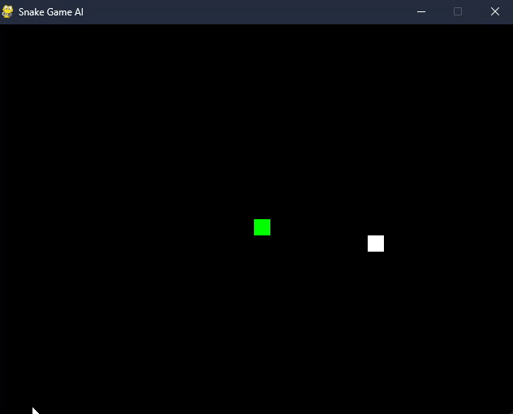

# SnakeNET_RL

*creator Michał Koziński*

## Introduction

This project was created as coursework for university subject 
*Advanced Machine Learning Methods*. The Goal of this project was 
simple - to create a neural network that could "play" *Snake Game*, 
but the task turned out not to be so easy, about that later.

First of all for those who don't know what *Snake* is: </br>
Snake is a genre of action video games where the player maneuvers the 
end of a growing line, often themed as a snake. The player must keep 
the snake from colliding with both other obstacles and itself, which 
gets harder as the snake lengthens.</br>

[Wikipedia](https://en.wikipedia.org/wiki/Snake_(video_game_genre))

Now when we all know what snake is we can continue to the next part.

## The game itself

Before I start with Machine Learning I need to create game environment. 
To achieve this, I used *Python* package called [*PyGame*](https://www.pygame.org/wiki/about).
I don't need anything special, so it looked rather simple: 
</br>
> Actually, for the next parts I created a completely 
new version, which, of course, was highly based on the one presented, 
but needed a little reinforcement learning shine. 

## Reinforcement Learning

It is time for me to present the most important part, which is 
the essence of this project.

### First attempt

My first idea was to start as simple as possible, so I 
created LSTM-based neural network with an LSTM layer 
with a fully connected output layer. Network was 
trained using [Deep Q Learning algorithm](https://arxiv.org/abs/1312.5602) 
which was implemented using DQNAgent. Here are some details:
- as input DQNA take list of six values specifying respectively: 
  - Two coordinates of snake head (x and y in pixels), 
  - Two food coordinates (x and y in pixels),
  - Two values representing change of position in pixels of sakes 
head which will inform about a way snake is heading,
- as output DQNA return list of four boolean values, which only 
one can be TRUE for each step, those values indicate what action 
should be taken,
- as optimizer, I used an algorithm called [*Adaptive Moment Estimation*](https://arxiv.org/abs/1412.6980) known as *ADAM*,
- for criterion, I used PyTorch implementation of [*MSELoss*](https://pytorch.org/docs/stable/generated/torch.nn.MSELoss.html).

**Reward function** was declared as follows:
- the score was incrementing by 10 for each food collected by snake,
- the score was decreasing by 10 if the game was ended due to sneak 
head colliding with wall or snake tail.

**Training** of the network was done in episodes, where one episode 
corresponded to one game played on a 640x480 resolution board. The 
gameplay lasted until the game was completed, or until 500 seconds 
had elapsed. The score, and consequently the reward function, were 
updated in every step.

#### Result

The first attempt was a complete failure. LSTM had problems with 
achieving at least one score and games usually ended without any 
food collected by snake. All I could do was learn my lesson and 
try again.

> **Network architecture:** LSTM
> 
> **Training time:** 2000 episodes, >18 hours (local machine)
> 
> **Outcome:** Lost due to a computer crash

### Second attempt

After the first attempt, which was not very successful, 
I came to the conclusion that my approach needs to change.
My first thought was to try another architecture, so I decided 
to try Residual Neural Network (RNN) architecture. In fact, 
everything except one layer has remained the same as in the 
previous attempt.

#### Result

This attempt, despite many hours spent training the network, 
was not successful either. The result I received was not what 
I expected, so all I could do was try again.

> **Network architecture:** RNN
> 
> **Training time:** 10 500 episodes, >30 hours (local machine) and ~15 hours (kaggle notebook)
> 
> **Outcome:** </br>

### Third attempt 

[//]: # (rcnn_old - zmiana architektury)

Given the results achieved by LSTM and RNN, I decided to test 
yet another neural network architecture. This time inspired by 
"[Alpha GO](https://deepmind.google/technologies/alphago/)" - 
a breakthrough solution, prepared by Google DeepMind, which was 
the first program that managed to beat a professional player in 
"GO" - I set my sights on RCNN. This time, too, the only thing 
that was changed was the network, and the rest of the code 
remained unchanged. Below, you can see a schematic diagram of used
ResidualCNN.

<details>
  <summary>Schematic Diagram of new NN</summary>

  ```
  ResidualCNN
  |
  |-- Conv2d (input_dim, 32, kernel_size=3, stride=1, padding=1)
  |-- BatchNorm2d (32)
  |-- ReLU
  |
  |-- ResidualBlock (32, 32, stride=1)
  |    |-- Conv2d (32, 32, kernel_size=3, stride=1, padding=1)
  |    |-- BatchNorm2d (32)
  |    |-- ReLU
  |    |-- Conv2d (32, 32, kernel_size=3, stride=1, padding=1)
  |    |-- BatchNorm2d (32)
  |    |-- (Optional: Conv2d (32, 32, kernel_size=1, stride=1) for shortcut)
  |    |-- Add
  |    |-- ReLU
  |
  |-- ResidualBlock (32, 32, stride=1) x2
  |    |-- Conv2d (32, 32, kernel_size=3, stride=1, padding=1)
  |    |-- BatchNorm2d (32)
  |    |-- ReLU
  |    |-- Conv2d (32, 32, kernel_size=3, stride=1, padding=1)
  |    |-- BatchNorm2d (32)
  |    |-- Add
  |    |-- ReLU
  |
  |-- ResidualBlock (32, 64, stride=2)
  |    |-- Conv2d (32, 64, kernel_size=3, stride=2, padding=1)
  |    |-- BatchNorm2d (64)
  |    |-- ReLU
  |    |-- Conv2d (64, 64, kernel_size=3, stride=1, padding=1)
  |    |-- BatchNorm2d (64)
  |    |-- (Optional: Conv2d (32, 64, kernel_size=1, stride=2) for shortcut)
  |    |-- Add
  |    |-- ReLU
  |
  |-- ResidualBlock (64, 64, stride=1) x2
  |    |-- Conv2d (64, 64, kernel_size=3, stride=1, padding=1)
  |    |-- BatchNorm2d (64)
  |    |-- ReLU
  |    |-- Conv2d (64, 64, kernel_size=3, stride=1, padding=1)
  |    |-- BatchNorm2d (64)
  |    |-- Add
  |    |-- ReLU
  |
  |-- Flatten
  |
  |-- Linear (384, 1024)
  |-- ReLU
  |
  |-- Linear (1024, 512)
  |-- ReLU
  |
  |-- Linear (512, action_dim)

  ```
</details>

#### Result

What I was able to get after training RCNN for a very long time 
was not what I was aiming for, nevertheless, it was possible to 
see a significant improvement over previous attempts, which gave 
me hope and strength to continue. Playing back the gameplay using 
the trained network, it was possible to see, admittedly quite 
clumsy, but nevertheless some attempts to find the fruit close
to the starting location.

> **Network architecture:** RCNN
> 
> **Training time:** 11000 episodes, >12 hours (local machine) and >45 hours (kaggle notebook)
> 
> **Outcome:** </br>

### Fourth attempt

[//]: # (rcnn - zmiana funkcji nagrody)

Seeing the improvement, I decided to stay with this architecture. 
What I had to do now was find a way to get more out of it. The step 
I decided on was to use the new, more complex reward function and 
teach from scratch using it. 

The new reward function worked as follows:
- for each step, a small penalty equal to 1 was imposed,
- for eating a fruit, the value of the reward function was increased 
by 10,
- ending the game by colliding with a wall or tail resulted in 
a deduction of 10 points from the score.

#### Result

The result achieved turned out to be very close to the one I got in 
the previous attempt, however, this time I managed to do it in a much 
shorter time, which was undoubtedly a success.


> **Network architecture:** RCNN
> 
> **Training time:** 3200 episodes, >18 hours (local machine)
> 
> **Outcome:** </br>

### Fifth attempt

[//]: # (rcnn3 - zmiana rozdzelczości)

Looking at the history of scores achieved, you can see that the previous 
model capped around 25 score and showed no chance of improvement.
Therefore, I decided to simplify the task by reducing the board to 
240x240 pixels, which brought a significant improvement on the results.

#### Result


> The gap between episodes 6025–6800 is due to a csv file saving error. 

Despite achieving better scores, this did not translate into the quality 
of the network in terms of the gameplay pattern, which remained the same. 
The improvement turned out to be only apparent, as it was caused by a higher 
probability of randomly finding food near the starting location.

> **Network architecture:** RCNN
> 
> **Training time:** 7500 episodes, >50 hours (local machine)
> 
> **Outcome:** </br>

## Conclusion

What I have achieved so far, despite having taught me a lot, is not fully 
satisfactory, which leaves a huge area for further development of 
this project. 

My next idea is to follow the inspiration of "Alpha GO" even further and 
convert the input into a matrix representing the values for each pixel on 
the board.

For now, however, I need (and more so my hardware) a break, due to the time and resource-intensive nature of this project.
